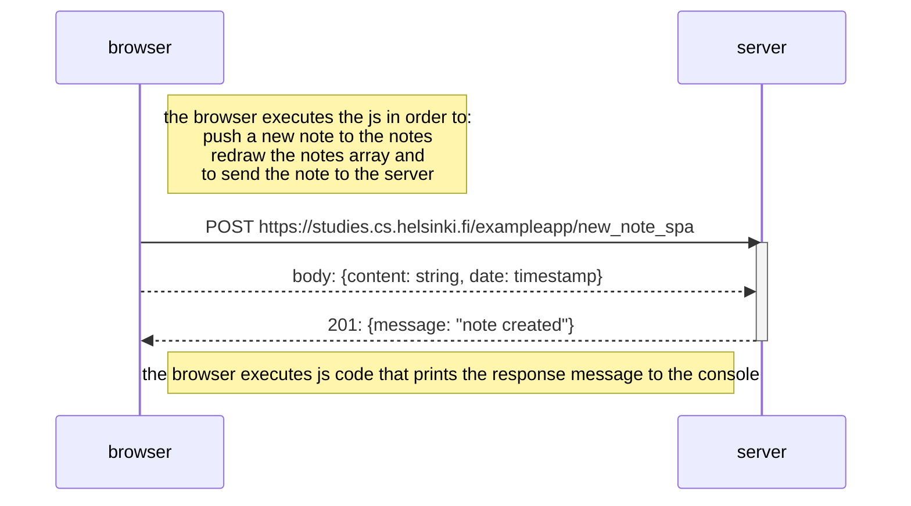

```mermaid
sequenceDiagram
  participant browser
  participant server

  note right of browser: the browser executes the js in order to:<br>push a new note to the notes<br>redraw the notes array and<br>to send the note to the server

  browser ->> server: POST https://studies.cs.helsinki.fi/exampleapp/new_note_spa
  activate server
  browser -->> server: body: {content: string, date: timestamp}
  server -->> browser: 201: {message: "note created"}
  deactivate server

  note right of browser: the browser executes js code that prints the response message to the console

```